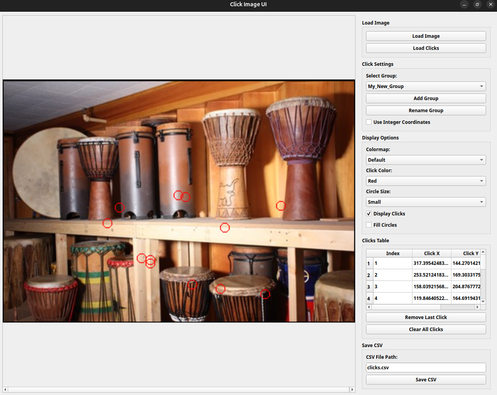

# pyclickimage

## Description

UI to collect 2D-coordinates of points on an image.
The points can be separated into various groups.



The output ``csv`` will have the following format:

```
Group,Index,Click X,Click Y
default,0,128,102
default,1,115,153
default,2,207,181
default,3,261,134
default,4,220,83
default,5,151,37
Coco,0,201,126
Coco,1,105,119
Coco,2,90,80
Coco,3,126,51
Coco,4,206,59
Coco,5,261,93
Coco,6,212,157
Coco,7,166,175
```

**X** is the column-index of the click in the image and **Y** is the row-index of the click in the image such as for a NumPy Array the click is at **image[Y, X]**.


## Authors

- Artezaru <artezaru.github@proton.me>

- **Git Plateform**: https://github.com/Artezaru/pyclickimage.git
- **Online Documentation**: https://Artezaru.github.io/pyclickimage

## Installation

Install with pip

```
pip install git+https://github.com/Artezaru/pyclickimage.git
```

Clone with git

```
git clone https://github.com/Artezaru/pyclickimage.git
```

## WARNING

This package use ``PyQt5`` to display the GUI. 
If you have ``opencv-python`` installed on your environment, it will should be replaced by ``opencv-python-headless`` to avoid conflicts.
This package is not compatible with the full ``opencv-python``.

## License

See LICENSE
