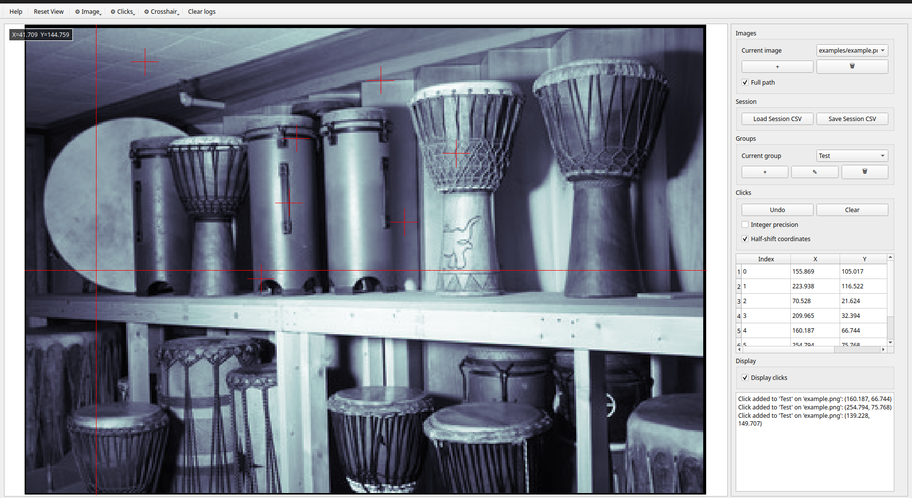

Welcome to pyclickimage's documentation!
========================================

Description of the package
--------------------------

``pyclickimage`` is a Python package providing a graphical interface to
collect 2D coordinates of points on images.

The application supports:

- multiple images per annotation session,
- multiple annotation groups,
- subpixel floating-point coordinates,
- CSV session import/export,
- visualization and display controls,
- programmatic extraction of annotations.

Contents
--------

The documentation is divided into the following sections:

- **Installation**: How to install the package.
- **API Reference**: Reference documentation for user functions and developer classes.
- **Usage**: Tutorials and examples explaining how to use the application.

.. toctree::
   :maxdepth: 1
   :caption: Contents:

   ./installation
   ./api
   ./usage

Running the application
-----------------------

A terminal command is installed with the package to launch the graphical
interface:

.. code-block:: bash

    pyclickimage-gui

The application can also be launched from Python using:

.. code-block:: python

    import pyclickimage

    pyclickimage.run()

Annotation sessions
-------------------

Annotations are stored as complete sessions.

A session can contain multiple images and multiple annotation groups.
The CSV format is:

.. code-block:: text

    Image,Group,Index,X,Y
    image_1.png,default,0,128.5,102.0
    image_1.png,default,1,115.2,153.7
    image_1.png,Coco,0,201.0,126.5
    image_2.png,default,0,80.0,45.3

Coordinates are stored as floating-point values to preserve subpixel
precision.

The coordinates follow NumPy image indexing conventions:

.. code-block:: python

    image[Y, X]

where:

- ``X`` is the horizontal coordinate (column index),
- ``Y`` is the vertical coordinate (row index).

Author
------

The package ``pyclickimage`` was created by:

- Artezaru <artezaru.github@proton.me>

Resources
---------

The source code and documentation are available at:

- **GitHub repository**:
  https://github.com/Artezaru/pyclickimage

- **Online documentation**:
  https://Artezaru.github.io/pyclickimage

License
-------

``pyclickimage`` is distributed under the GNU General Public License
version 3 or later (GPL-3.0-or-later).

See the ``LICENSE`` file included with the package for more information.