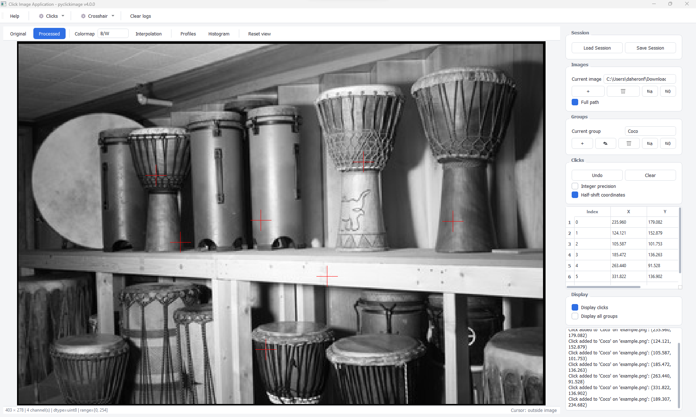

Welcome to pyclickimage's documentation!
========================================

Description of the package
--------------------------

``pyclickimage`` is a Python package providing a graphical interface to
collect 2D coordinates of points on images.

The application supports:

- multiple images per annotation session,
- multiple annotation groups,
- subpixel floating-point coordinates,
- JSON session save/restore (default format) and CSV export,
- visualization and display controls,
- programmatic extraction of annotations.

Contents
--------

The documentation is divided into the following sections:

- **Installation**: How to install the package.
- **API Reference**: Reference documentation for user functions and developer classes.
- **Usage**: Tutorials and examples explaining how to use the application.

.. toctree::
   :maxdepth: 1
   :caption: Contents:

   ./installation
   ./api
   ./usage

Running the application
-----------------------

A terminal command is installed with the package to launch the graphical
interface:

.. code-block:: bash

    pyclickimage-gui

The application can also be launched from Python using:

.. code-block:: python

    import pyclickimage

    pyclickimage.run()

Releases (standalone application)
---------------------------------

Ready-to-use executables are published for each version on the
`GitHub Releases page <https://github.com/Artezaru/pyclickimage/releases>`_.
No Python installation is required.

.. list-table::
    :header-rows: 1
    :widths: 30 40 30

    * - Platform
      - File
      - Download
    * - Windows
      - ``pyclickimage-windows.exe``
      - `latest <https://github.com/Artezaru/pyclickimage/releases/latest/download/pyclickimage-windows.exe>`__
    * - Linux (any distribution)
      - ``pyclickimage-linux``
      - `latest <https://github.com/Artezaru/pyclickimage/releases/latest/download/pyclickimage-linux>`__
    * - Debian / Ubuntu
      - ``pyclickimage_X.Y.Z_amd64.deb``
      - `releases page <https://github.com/Artezaru/pyclickimage/releases/latest>`__

**Windows**

Download ``pyclickimage-windows.exe`` and double-click it.

Windows SmartScreen may display a warning because the executable is not
signed: click **More info** then **Run anyway**.

**Linux (standalone executable)**

.. code-block:: bash

    chmod +x pyclickimage-linux
    ./pyclickimage-linux

**Debian / Ubuntu (.deb package)**

Installing the ``.deb`` package adds ``pyclickimage`` to the applications
menu and installs the required system libraries:

.. code-block:: bash

    sudo apt install ./pyclickimage_X.Y.Z_amd64.deb

Replace ``X.Y.Z`` with the downloaded version. To uninstall:

.. code-block:: bash

    sudo apt remove pyclickimage

Once the ``.deb`` package is installed, the application accepts the same
options as the Python command:

.. code-block:: bash

    pyclickimage -i image1.tif image2.tif
    pyclickimage -s annotations.json

Annotation sessions
-------------------

Annotations are stored as complete sessions.

A session can contain multiple images and multiple annotation groups.

Two file formats are supported:

- **JSON** (default): complete session backup and restoration.
- **CSV**: annotation export to external tools.

JSON session format
~~~~~~~~~~~~~~~~~~~

The JSON format is the default and recommended format for saving and
restoring annotation projects.

It stores the complete state of the annotation session, including:

- image paths,
- annotation groups,
- click coordinates,
- current selections,
- session options.

A JSON session can be loaded later to restore the project exactly as it
was saved:

.. code-block:: json

    {
        "precision_mode": "float",
        "current_image_index": 0,
        "current_group_index": 1,
        "groups": [
            "default",
            "Coco"
        ],
        "images": [
            {
                "path": "image_1.png",
                "groups": {
                    "default": [
                        [128.5, 102.0],
                        [115.2, 153.7]
                    ],
                    "Coco": [
                        [201.0, 126.5]
                    ]
                }
            }
        ]
    }

CSV export format
~~~~~~~~~~~~~~~~~

The CSV format is intended for exporting annotations to external tools
such as spreadsheets or data processing pipelines:

.. code-block:: text

    Image,Group,Index,X,Y
    image_1.png,default,0,128.5,102.0
    image_1.png,default,1,115.2,153.7
    image_1.png,Coco,0,201.0,126.5
    image_2.png,default,0,80.0,45.3

The CSV columns are:

- ``Image``: image file path.
- ``Group``: annotation group name.
- ``Index``: point index inside the group.
- ``X``: horizontal coordinate.
- ``Y``: vertical coordinate.

Empty points can also be stored when a click is intentionally skipped:

.. code-block:: text

    Image,Group,Index,X,Y
    image_1.png,default,2,,

CSV files do not store the complete application state. For saving and
restoring complete projects, use the JSON format.

Coordinates
~~~~~~~~~~~

Coordinates are stored as floating-point values to preserve subpixel
precision.

The coordinates follow NumPy image indexing conventions:

.. code-block:: python

    image[Y, X]

where:

- ``X`` is the horizontal coordinate (column index),
- ``Y`` is the vertical coordinate (row index).

Author
------

The package ``pyclickimage`` was created by:

- Artezaru <artezaru.github@proton.me>

Resources
---------

The source code and documentation are available at:

- **GitHub repository**:
  https://github.com/Artezaru/pyclickimage

- **Releases (executables)**:
  https://github.com/Artezaru/pyclickimage/releases

- **Online documentation**:
  https://Artezaru.github.io/pyclickimage

License
-------

``pyclickimage`` is distributed under the GNU General Public License
version 3 or later (GPL-3.0-or-later).

See the ``LICENSE`` file included with the package for more information.